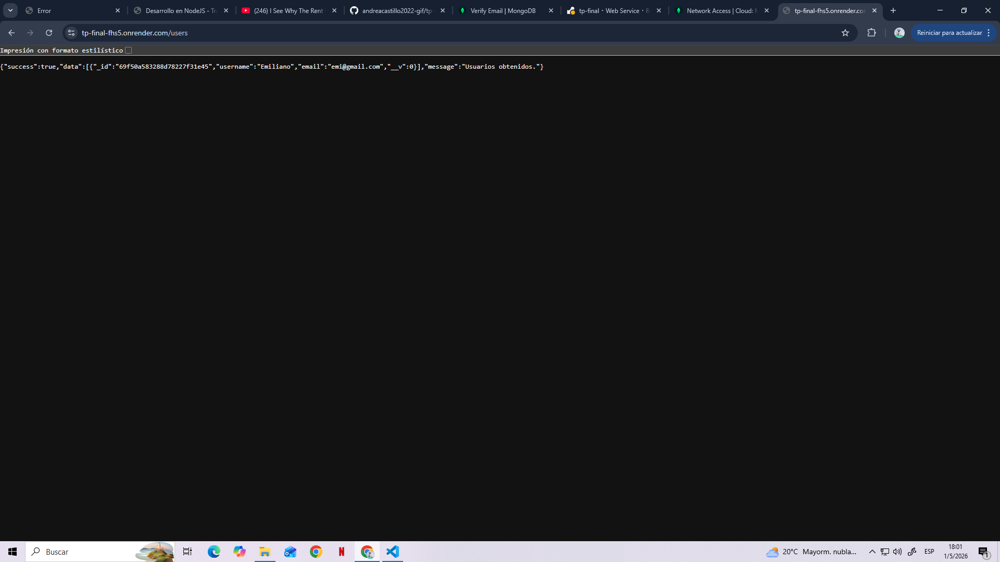
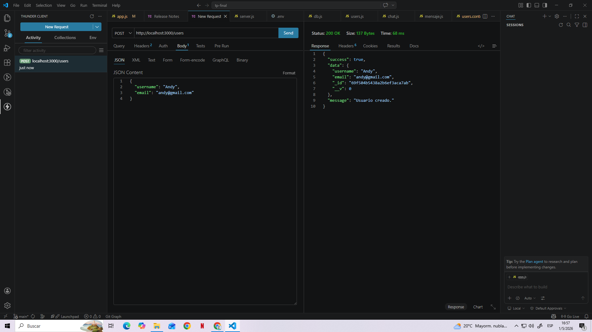
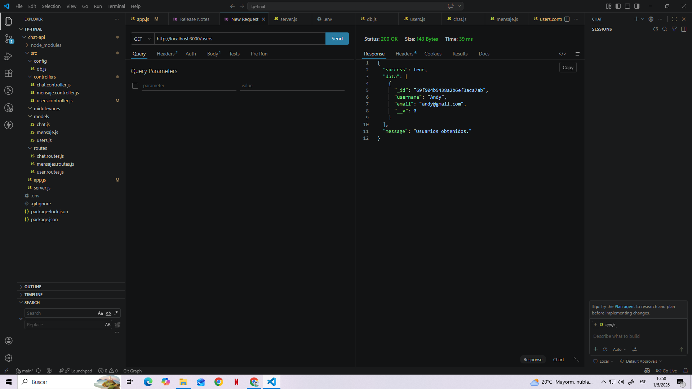
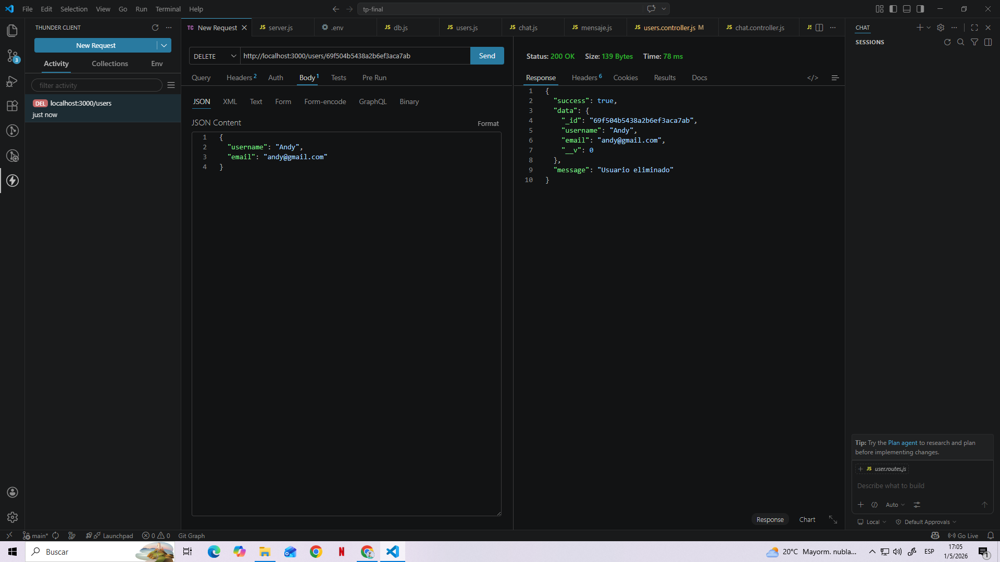
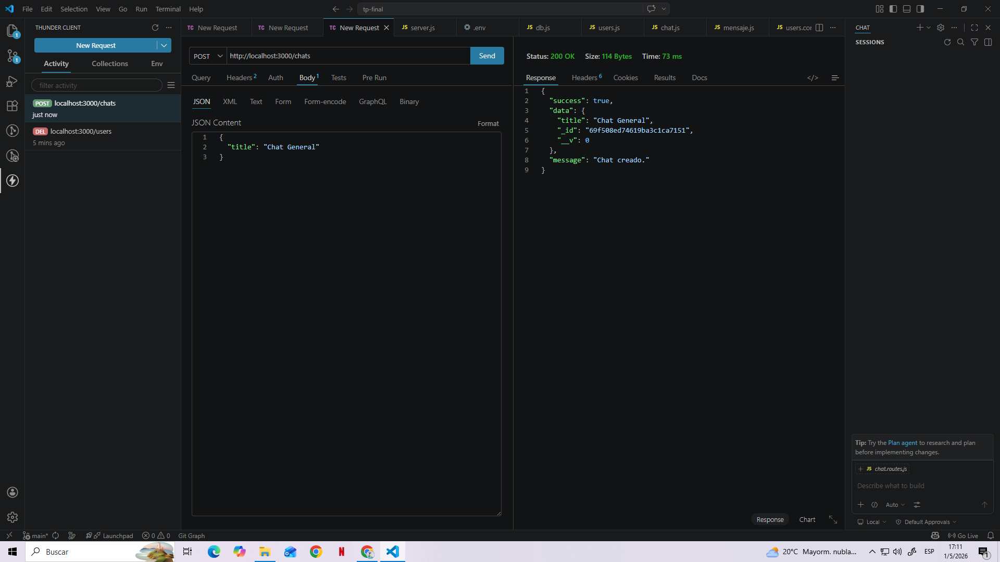
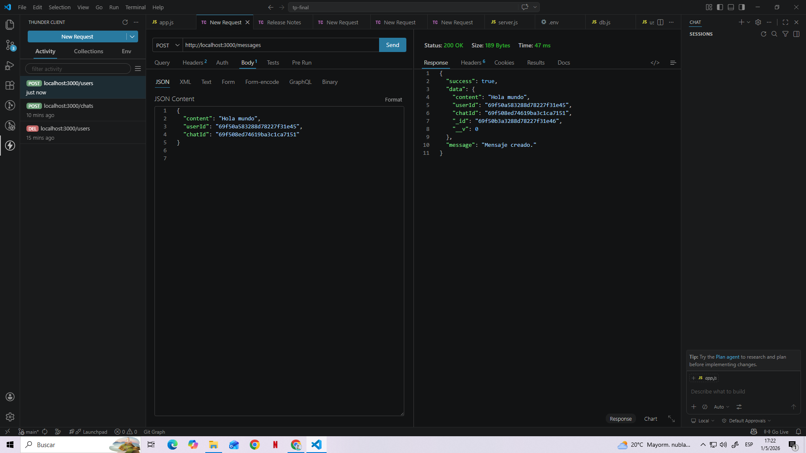

# Chat API - Trabajo Final Node.js

API REST desarrollada con Node.js, Express y MongoDB para gestión de usuarios, chats y mensajes. CON DEPLOY EN RENDER

## Tecnologías utilizadas

- Node.js
- Express.js
- MongoDB Atlas
- Mongoose
- dotenv

## Como abrir

npm install
npm run dev


## Endpoints
## Usuarios
- GET /users
- POST /users
- DELETE /users/:id

### Chats

- GET /chats
- POST /chats
- DELETE /chats/:id

### Messages

- GET /meessages
- POST /messages
- DELETE /messages/:id

## Ejemplo request
DEPLOY EN RENDER


POST /users

```json
{
  "username": "Andy",
  "email": "andy@gmail.com"
}
Andy fue eliminado y actualmente existe el siguiente usuario que
se usó para unir todo, tanto como id de mensaje y usuario formando un chat
```







```json
{
  "username": "Emiliano",
  "email": "emi@gmail.com"
}
```


